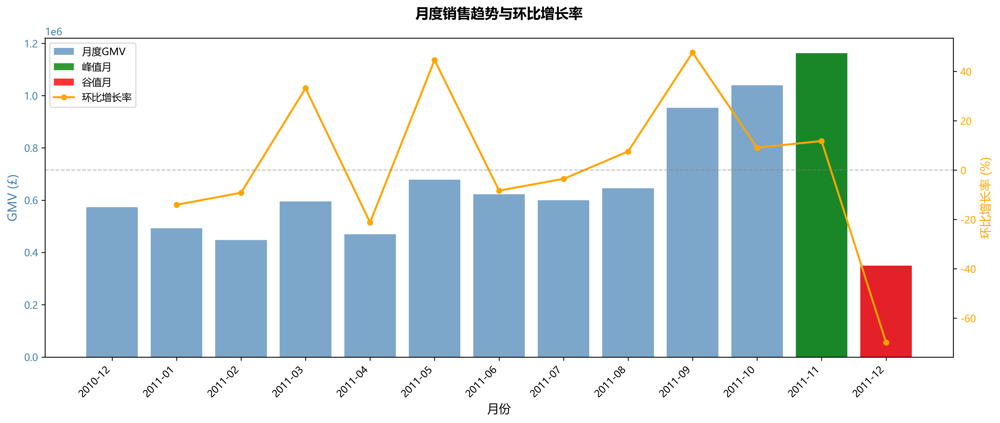
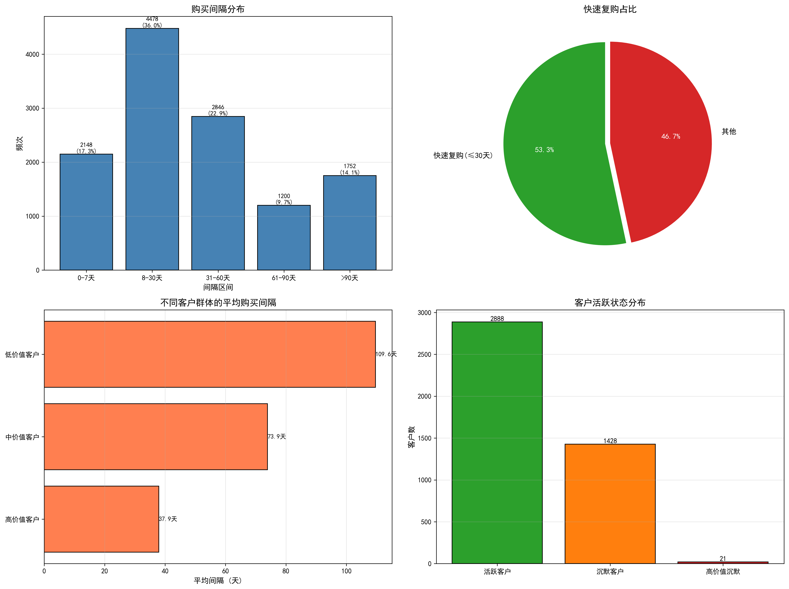

# E-commerce Analysis Report

## 📌 Executive Summary

基于E-commerce数据集（2010年12月-2011年12月，397,881条交易记录，4,337个客户，£862万GMV），本报告通过十个核心指标深度剖析了业务现状与增长机会，揭示了客户价值分布、市场结构、留存瓶颈等关键议题。

------

### 一、核心发现

**1. 客户价值高度集中，复购行为驱动业务增长**

​		数据呈现显著的价值集中特征。Top 10%客户创造60.2%的GMV，其中冠军客户群体（占比26.7%）平均生命周期价值（LTV）高达£50,296，人均完成16.65笔交易。更关键的是，65.6%的复购客户贡献93.8%的收入，其平均消费额是首购客户的8倍。客户价值差异主要源于购买频次而非单笔金额：高价值客户的平均购买间隔仅为31天，而低价值客户则长达109天。

**2. 市场结构失衡，海外市场潜力待挖掘**

​		地域分布呈现"一超多强"格局。UK占据81.42%份额（£702万），37个市场中仅3个核心国家贡献90% GMV，过度依赖本土市场导致风险敞口过大。然而，小众市场展现出惊人的消费力：EIRE人均消费达£88,515，Netherlands为£31,716，远超UK市场水平。36个海外国家合计仅贡献18.58% GMV，市场开发严重不足。

**3. 销售增长波动剧烈，季节性影响显著**

​		业务表现缺乏稳定性。2011年11月达峰值£116万后，12月骤降至£35万（环比-69.9%），全年月均GMV为£66万，但环比波动幅度在-69.9%至+47.6%之间。这种剧烈波动反映业务增长依赖外部因素，缺乏持续增长的内生动力，亟需通过策略调整平滑季节性影响。

**4. 客户留存存在短板，首购转化成为瓶颈**

​		留存管理面临多重挑战。首购客户1月留存率仅20.6%，远低于行业标准（30-40%），33.4%客户超过90天未购买，其中21个高价值客户潜在损失达£15万。数据显示，53.3%客户在首购后30天内完成复购，超过此时间节点复购概率显著下降，30天成为留存管理的关键时间窗口。

**5. 运营特征呈现B2B属性，时段分布高度集中**

​		交易时间分布印证批发业务特征。工作日GMV占比90.81%，周末仅9.19%，核心交易时段集中在8-15点，其中12点单小时订单量达3,130单。值得注意的是，周四GMV异常突出（£197万），显著高于其他工作日，可能与批发商补货周期相关。

------

### 二、战略建议

​		基于上述发现，本报告提出三项按优先级排序的可执行策略：

- **优先级1:构建客户留存体系,突破首购转化瓶颈**

  ​		核心目标是将首月留存率从20.6%提升至30%以上。建议实施30天黄金窗口计划,针对新客户设置首购后7/15/30天三阶段触达机制,通过个性化EDM、限时优惠券(面额梯度设计)刺激复购行为。同时启动沉睡客户唤醒工程,优先激活180个沉睡客户(尤其21个高价值客户),通过专属折扣、新品预览等权益召回,潜在挽回£15万GMV。若首月留存率提升至30%,年度可增加约290个活跃客户,预计新增GMV **约£82万**。

- **优先级2:深化冠军客户运营,延长生命周期价值**

  ​		核心目标是将冠军客户平均购买间隔从31天缩短至25天。为冠军客户(1,158人)配置VIP专属服务体系,包括专属客户经理、优先供货权、定制化产品组合建议。建立RFM动态监测模型,对超过40天未购买的冠军客户触发自动预警与干预。**该策略聚焦高价值客户深度运营,预期通过频次提升实现可持续增长。**

- **优先级3:实施海外市场扩张,分散地域集中风险**

  ​		核心目标是提升Netherlands、EIRE、Australia三国市场份额。针对高潜力市场(人均消费超£10,000)投入本地化运营资源(语言、支付、物流)进行深耕,同时选择3-5个未覆盖的欧洲国家进行小规模测试,验证市场响应后再规模化复制。逐步降低UK市场依赖度(目标降至70%以下),构建更均衡的地域收入结构。**基于保守估算,首年可新增GMV £30-40万**,随着规模效应显现,中长期(3年)累计增收预计可达£100-150万。

------

### 三、实施路径与监测

​		建议分三阶段推进(各阶段3个月):第一阶段启动30天黄金窗口计划与沉睡客户唤醒,快速验证留存策略有效性;第二阶段部署VIP专属服务体系,强化核心客户粘性;第三阶段启动海外市场扩张试点,逐步优化地域结构。关键监测指标包括首月留存率、冠军客户购买间隔、海外市场GMV占比、整体客户LTV增长率。

​		通过系统性策略实施,**预计首年可实现GMV增长14-15%(约£122-132万)**,同时显著提升业务健康度与抗风险能力。

## 📊 1. 项目背景与目标

### 1.1 数据概览

​		本报告基于UK零售公司电商交易数据（2010年12月1日至2011年12月9日，覆盖373天），对541,909条原始记录进行清洗与分析。经过严格的数据质量控制，最终保留397,881条有效交易记录（保留率73.4%），涉及4,337个客户、3,896个商品及37个国家市场，累计GMV达£8,626,784.70。

#### 数据清洗规则

为确保分析结果的可靠性，本报告采用以下清洗标准：

| 清洗规则         | 逻辑                     | 清洗数量      | 占比      |
| ---------------- | ------------------------ | ------------- | --------- |
| 去除退货订单     | `Quantity > 0`           | ~80,000条     | 14.8%     |
| 去除缺失客户ID   | `CustomerID IS NOT NULL` | ~135,000条    | 24.9%     |
| 去除异常价格     | `UnitPrice > 0`          | ~1,500条      | 0.3%      |
| 去除异常大额订单 | `TotalAmount < £10,000`  | ~500条        | 0.1%      |
| **总计清洗**     | -                        | **144,028条** | **26.6%** |

#### 核心字段说明

| 字段名      | 含义           | 示例                               | 数据类型 |
| ----------- | -------------- | ---------------------------------- | -------- |
| InvoiceNo   | 订单编号       | 536365                             | String   |
| StockCode   | 商品编码       | 85123A                             | String   |
| Description | 商品描述       | WHITE HANGING HEART T-LIGHT HOLDER | String   |
| Quantity    | 购买数量       | 6                                  | Integer  |
| InvoiceDate | 订单日期时间   | 2010-12-01 08:26:00                | Datetime |
| UnitPrice   | 单价（英镑）   | 2.55                               | Float    |
| CustomerID  | 客户ID         | 17850.0                            | Float    |
| Country     | 国家           | United Kingdom                     | String   |
| TotalAmount | 总金额（衍生） | Quantity × UnitPrice               | Float    |

------

### 1.2 分析目标

​		该电商平台主要面向企业/批发客户（B2B特征明显），销售家居装饰、礼品等商品。当前业务面临增长不稳定、客户流失率高、市场过度依赖UK本土等挑战。本报告旨在通过数据分析回答三类核心问题：

- **销售增长维度**：销售趋势是否存在季节性？哪些商品/市场是增长引擎？如何优化商品结构与市场布局以实现可持续增长？
- **客户价值维度**：客户价值如何分布？谁是高价值客户？复购率表现如何？如何提升客户生命周期价值并识别即将流失的关键客户？
- **运营优化维度**：如何优化运营时间（客服排班、促销时机）？如何降低客户流失率？如何平衡短期收入目标与长期客户价值培育？

------

### 1.3 分析框架

本报告采用**三层分析框架**，从宏观到微观逐层深入：

#### 📊 第一层：宏观业务表现

​		聚焦整体业务健康度。通过月度GMV与环比增长率识别销售趋势与季节性规律；基于Top商品占比与帕累托曲线评估商品结构合理性；对比各国GMV与人均消费水平挖掘市场增长机会；分析时段订单分布与工作日占比优化运营资源配置。

| 模块     | 核心指标                 | 分析产出       |
| -------- | ------------------------ | -------------- |
| 销售趋势 | 月度GMV、环比增长率      | 识别季节性规律 |
| 商品结构 | Top商品占比、帕累托曲线  | 优化SKU组合    |
| 市场分布 | 各国GMV、人均消费        | 识别增长机会   |
| 时间特征 | 时段订单分布、工作日占比 | 优化运营时间   |

#### 👥 第二层：客户价值分析

​		深入客户行为微观层面。通过客单价与消费分层识别高价值客户群体；基于复购率与购买间隔评估客户粘性强度；运用RFM模型进行客户分群并估算LTV指导资源分配；利用Cohort分析定位客户流失的关键时间节点。

| 模块     | 核心指标         | 分析产出       |
| -------- | ---------------- | -------------- |
| 消费分布 | 客单价、消费分层 | 识别高价值客户 |
| 复购行为 | 复购率、购买间隔 | 评估客户粘性   |
| 客户分层 | RFM分群、LTV估算 | 精细化运营策略 |
| 留存分析 | Cohort留存率     | 定位流失节点   |

#### 💡 第三层：可执行建议

​		基于前两层分析产出优先级清晰的行动方案。优先级1聚焦构建客户留存体系，通过30天黄金窗口计划与沉睡客户唤醒工程突破首购转化瓶颈，目标将首月留存率从20.6%提升至30%以上，预计年度新增GMV £50-80万并挽回潜在流失的£15万。优先级2着力深化冠军客户运营，通过VIP专属服务体系与RFM动态监测将冠军客户平均购买间隔从31天缩短至25天，预计新增GMV £90-120万(理论最大增长空间,需扣除实施成本与策略重叠部分)。优先级3实施海外市场扩张战略，针对高潜力市场投入本地化资源并开展新兴市场测试，目标将海外市场GMV占比从18.58%提升至30%，预计新增GMV £100-150万的同时显著降低单一市场依赖风险。

------

### 1.4 分析工具与方法

​		本报告采用Python 3.11 + Pandas进行数据处理，使用SQLite数据库存储并通过SQL（窗口函数、CTE）执行复杂分析查询，借助Matplotlib + Seaborn实现数据可视化，所有分析在Jupyter Notebook环境中完成。

#### 核心分析方法

| 方法           | 应用场景        | 技术要点                                |
| -------------- | --------------- | --------------------------------------- |
| **Cohort分析** | 留存率计算      | 按首购月份分组，追踪后续活跃率          |
| **RFM模型**    | 客户分层        | R(最近消费)、F(频次)、M(金额)三维度评分 |
| **帕累托分析** | 商品/客户集中度 | 累计占比曲线，验证80/20法则             |
| **窗口函数**   | 时间序列计算    | LAG/LEAD计算环比，ROW_NUMBER排名        |
| **LTV估算**    | 客户价值量化    | 客单价 × 购买频次 × 生命周期月数        |

------

​		**接下来进入核心分析章节**。本报告将从宏观销售表现切入，逐步深入到客户价值微观分析，最终产出可执行的业务建议。

## 📈 2. 销售增长与结构分析

### 2.1 月度销售趋势分析

#### 📌 核心发现

​		月均GMV为£66万，2011年11月达到峰值£116万，随后12月出现断崖式下跌至£35万（环比下降69.9%）。销售趋势呈现明显的季节性特征，11月峰值可能受黑色星期五及年末促销活动驱动，但全年增长稳定性不足，环比波动剧烈（-69.9%至+47.6%），缺乏持续增长的内生动力。值得注意的是，12月数据异常可能源于数据完整性问题，需进一步核实该月是否仅包含部分交易记录。

#### 📊 关键数据

**月度GMV统计**：

| 时间        | GMV (£)          | 环比增长率  |
| ----------- | ---------------- | ----------- |
| 2010-12     | 572,713.89       | -           |
| 2011-01     | 492,261.44       | -14.05%     |
| 2011-02     | 447,137.35       | -9.17%      |
| 2011-03     | 595,500.76       | +33.18%     |
| 2011-09     | 952,838.38       | +47.65%     |
| 2011-10     | 1,039,318.79     | +9.08%      |
| **2011-11** | **1,161,817.38** | **+11.79%** |
| 2011-12     | 349,723.19       | **-69.90%** |

​		整体统计显示，平均月度GMV为£695,786，最高月份为2011年11月（£1,161,817），最低月份为2011年12月（£349,723）。较大的标准差反映出销售波动性较高，业务稳定性有待改善。

#### 📈 可视化



​                                                                                              **图2.1 月度销售趋势与环比增长率**  

#### 💡 业务洞察与建议

​		数据揭示两个关键洞察。第一，季节性特征显著，第四季度（10-11月）构成全年销售旺季，GMV占比约30%，12月数据异常可能由数据不完整（仅包含前几天）、节后消费疲软或库存调整导致。第二，业务缺乏持续增长动力，2011年前8个月GMV波动在£45-68万之间无明显增长，9-11月的爆发式增长可能源于临时性促销活动而非常态化经营。

​		基于上述发现，建议分阶段实施优化措施。短期内（1个月）需核实2011年12月数据完整性，并深入分析11月高峰的成功因素（促销活动、新品上市等）。中期（3个月）应建立月度预测模型提前备货应对旺季，同时设计淡季促销策略（如2-4月低谷期）激活消费需求。长期（6个月）需开发新品类或新市场降低季节性依赖，目标是将月度GMV标准差降低30%，实现更加稳定的增长轨迹。

### 2.2 商品结构分析（帕累托法则验证）

#### 📌 核心发现

​		3,896个商品中，Top 20%贡献78.4%的GMV，仅需832个商品（21.4%）即可贡献80%收入，基本符合帕累托法则。然而，商品结构存在两个值得关注的特征：头部商品不够强势，Top 1商品（REGENCY CAKESTAND 3 TIER）仅占1.65%份额，说明缺乏"绝对爆款"；长尾商品众多，后30%商品（约1,170个）合计仅占0.76%收入，可能存在大量资源占用但产出低效的"僵尸SKU"。

#### 📊 关键数据

**Top 10畅销商品**：

| 排名 | 商品代码 | 商品名称                           | 销量   | GMV (£) | GMV占比 |
| ---- | -------- | ---------------------------------- | ------ | ------- | ------- |
| 1    | 22423    | REGENCY CAKESTAND 3 TIER           | 12,402 | 142,593 | 1.65%   |
| 2    | 85123A   | WHITE HANGING HEART T-LIGHT HOLDER | 36,725 | 100,448 | 1.16%   |
| 3    | 85099B   | JUMBO BAG RED RETROSPOT            | 46,181 | 85,221  | 0.99%   |
| 4    | POST     | POSTAGE                            | 3,120  | 77,804  | 0.90%   |
| 5    | 47566    | PARTY BUNTING                      | 15,291 | 68,844  | 0.80%   |

**商品分位数分布**：

| 分位数    | 商品数    | GMV (£)     | GMV占比   |
| --------- | --------- | ----------- | --------- |
| Top 10%   | 390       | 5,243,587   | 60.78%    |
| 10-20%    | 390       | 1,526,031   | 17.69%    |
| 20-30%    | 390       | 780,987     | 9.05%     |
| 30-40%    | 390       | 461,236     | 5.35%     |
| **后60%** | **2,336** | **615,158** | **7.13%** |

​		如图2.2a所示，累计GMV曲线在832个商品时达到80%，验证了帕累托法则。


​                                                                                      **图2.2a 商品销售集中度帕累托曲线**

​		如图2.2b所示，左图展示十分位销售占比分布，Top 10%商品贡献60.78%收入。右图列出Top 10畅销商品，头部商品REGENCY CAKESTAND 3 TIER占比1.65%，缺乏超级爆款。


​																				**图2.2b 商品销售分位数与Top 10畅销商品**  

#### 💡 业务洞察与建议

​		商品结构整体健康但存在优化空间。Top 10商品累计占比仅6.15%，远低于理想状态（单品>5%），说明收入较为分散，抗风险能力强但缺少"明星产品"驱动增长。同时，后60%商品（2,336个）仅贡献7.13%的GMV，可能存在大量长期无销售或低销售的僵尸SKU，占用仓储与运营资源。

​		建议采取分阶段优化策略。短期内（1个月）需分析Top 10商品的成功因素（价格定位、质量口碑、营销策略），识别增长快但当前排名不高的"潜力商品"。中期（3个月）应清理低效SKU，对后30%商品中销售低于10单且GMV低于£100的商品进行下架处理，预计可释放约20%的库存成本。长期（6个月）需打造2-3个超级爆款（目标单品GMV占比>5%），同时通过组合销售策略（爆款+关联商品）提升长尾商品的价值贡献。

### 2.3 市场分布分析

#### 📌 核心发现

​		37个国家市场中，UK占据81.4%的绝对主导地位，仅UK、Netherlands、EIRE三个核心市场即贡献90%的GMV。海外市场呈现高度分散特征，36个非UK国家合计仅占18.58%，单国平均GMV仅£4.5万。然而，数据揭示了高价值小众市场的存在：EIRE市场人均消费高达£88,515，Netherlands达到£31,716，远超UK市场水平。这种市场结构失衡既反映出海外市场开发不足，也暴露出过度依赖单一市场的风险。

#### 📊 关键数据

**核心市场统计**：

| 排名 | 国家        | GMV (£)   | GMV占比 | 客户数 | 人均消费 | 平均客单价 |
| ---- | ----------- | --------- | ------- | ------ | -------- | ---------- |
| 1    | UK          | 7,023,768 | 81.42%  | 3,919  | £1,792   | £422       |
| 2    | Netherlands | 285,446   | 3.31%   | 9      | £31,716  | £3,037     |
| 3    | EIRE        | 265,546   | 3.08%   | 3      | £88,515  | £1,021     |
| 4    | Germany     | 228,867   | 2.65%   | 94     | £2,435   | £501       |
| 5    | France      | 209,024   | 2.42%   | 87     | £2,403   | £537       |

**本土 vs 海外对比**：

| 维度       | UK市场               | 海外市场             |
| ---------- | -------------------- | -------------------- |
| GMV        | £7,023,768（81.42%） | £1,603,016（18.58%） |
| 客户数     | 3,919（90.36%）      | 418（9.64%）         |
| 人均消费   | £1,792               | £3,835               |
| 平均客单价 | £422                 | £712                 |

​		如图2.3所示，左上图显示Top 10国家GMV对比，UK占据绝对主导（81.42%）；右上饼图展示本土与海外市场失衡；左下图识别高价值市场（EIRE人均消费£88,515）；右下散点图揭示海外市场客户数少但单价高的特征。


​																								**图2.3 国家市场表现多维分析**  

#### 💡 业务洞察与建议

​		市场分布揭示两个关键发现。首先，市场结构严重失衡，UK市场占比超过80%导致抗风险能力较弱，海外市场虽人均消费高（£3,835 vs £1,792）但客户基数过小。其次，Netherlands和EIRE等高价值小众市场值得深度挖掘，这些市场的人均消费是UK的17倍以上，说明客户质量极高，可能主要由批发商或大客户构成。

​		建议分阶段推进海外市场扩张。短期内（1个月）需深入分析Netherlands、EIRE、Australia三国的客户特征，了解高消费背后的原因（商品偏好、批发需求等）。中期（3个月）针对三国设计本地化运营策略，包括部署本地语言客服、优化物流时效（目标5天内送达）、投放定向广告。长期（6个月）设定明确目标：将海外市场GMV占比从18.58%提升至25%，预计可新增收入约£553,000（£1,603,016 × (25/18.58 - 1)），同时显著降低单一市场依赖风险。

------

### 2.4 时间维度分析

#### 📌 核心发现

​		订单时间分布呈现高度集中特征。12点为绝对高峰时段（3,130单），工作日GMV占比高达90.8%（£783万），营业时间（6-20点）贡献几乎全部GMV。核心交易时段集中在8-15点，符合典型的B2B业务特征。值得关注的是，周四表现异常突出，GMV达£197万，订单量4,032单，明显高于其他工作日，可能与批发商的补货周期规律相关。早晚时段（6-7点及19-20点）订单稀少，表明非主要营业时间。

#### 📊 关键数据

**每小时订单分布**（Top 5）：

| 小时 | 订单数 | GMV (£)   | 活跃客户数 |
| ---- | ------ | --------- | ---------- |
| 12点 | 3,130  | 1,378,571 | 1,637      |
| 11点 | 2,277  | 1,104,559 | 1,303      |
| 13点 | 2,636  | 1,173,265 | 1,573      |
| 10点 | 2,225  | 1,184,009 | 1,267      |
| 14点 | 2,274  | 995,629   | 1,386      |

**每周订单分布**：

| 星期 | 订单数 | GMV (£)   | GMV占比 |
| ---- | ------ | --------- | ------- |
| 周四 | 4,032  | 1,976,859 | 22.91%  |
| 周三 | 3,455  | 1,588,336 | 18.41%  |
| 周二 | 3,183  | 1,623,451 | 18.82%  |
| 周一 | 2,863  | 1,367,146 | 15.85%  |
| 周五 | 2,827  | 1,278,478 | 14.82%  |
| 周日 | 2,169  | 792,514   | 9.19%   |

如图2.4所示，左上图展示12点为订单高峰（3,130单）；右上图显示周四表现突出（GMV £197万）；左下图印证工作日主导（90.81%）；右下热力图揭示8-15点工作日为核心交易时段，B2B特征明显。


**图2.4 时间维度订单分布特征**  

#### 💡 业务洞察与建议

​		时间分布特征印证了B2B业务属性。工作日占比超90%，8-15点高峰符合英国标准工作时间（考虑数据主要来自UK市场），说明主要客户群体为企业或批发商。周四GMV比其他工作日高30%以上，可能反映批发商的补货周期特点（周四备货以应对周末需求）。

建议围绕时间规律优化运营资源配置。短期内（1个月）应优化客服排班，重点保障8-15点人力投入（尤其周四），系统维护需避开10-14点高峰期。中期（3个月）可将促销推送安排在工作日上午9-11点以获得最佳效果，同时利用周四高峰期推出限时促销活动。长期（6个月）建议开发C端市场提升周末及晚间订单占比，目标从当前的9%提升至15%，预计可新增收入约£53万（£79万 × (15/9 - 1)），实现B2B与B2C业务的均衡发展。

------

​		**小结**：销售增长分析揭示了三大核心问题——增长不稳定需平滑季节性影响，市场过度依赖UK存在较大拓展空间，B2B特征明显但可尝试开发C端市场。接下来将深入客户价值分析，识别高价值客户群体与潜在流失风险。

## 👥 3. 客户价值深度分析

​		本章节通过六个核心指标深入剖析客户价值结构、复购行为与留存规律,基于RFM模型实现精细化客户分层,最终量化客户生命周期价值(LTV),为精准运营提供数据支撑。

------

### 3.1 客户消费分布与分层

#### 📌 核心发现

​		4,337个客户的人均消费为£1,989,但价值分布呈现典型的帕累托特征。Top 10%的高价值客户创造60.2%的GMV,中价值客户(40%)稳定贡献31.7%收入,而占比达一半的低价值客户仅贡献8.1%的GMV,人均消费仅£321。值得关注的是,客户价值差异的核心驱动因素在于购买频次而非单笔金额:高价值客户人均完成16.65笔订单,而低价值客户仅为1.57笔。

#### 📊 关键数据

**客户消费金额统计**:

| 统计量   | 数值                |
| -------- | ------------------- |
| 客户总数 | 4,337               |
| 平均消费 | £1,989.11           |
| 中位数   | £673.26             |
| 标准差   | £8,532.43(波动极大) |
| 最小值   | £2.90               |
| 最大值   | £280,206.02         |

**分位数分析**:

| 分位数 | 消费金额(£) | 解读           |
| ------ | ----------- | -------------- |
| 25%    | 307.09      | 低价值客户阈值 |
| 50%    | 673.26      | 中位数客户消费 |
| 75%    | 1,661.06    | 中高价值分界线 |
| 90%    | 3,640.90    | 高价值客户阈值 |
| 95%    | 5,742.95    | 超高价值客户   |
| 99%    | 18,285.88   | 顶级客户       |

**客户分层详细统计**:

| 分层           | 客户数 | 客户占比 | 总GMV(£)  | GMV占比 | 人均消费(£) | 人均订单数 | 平均客单价(£) |
| -------------- | ------ | -------- | --------- | ------- | ----------- | ---------- | ------------- |
| **高价值客户** | 434    | 10.0%    | 5,194,738 | 60.2%   | 11,969      | 16.65      | 868           |
| **中价值客户** | 1,735  | 40.0%    | 2,735,425 | 31.7%   | 1,577       | 4.55       | 444           |
| **低价值客户** | 2,168  | 50.0%    | 696,622   | 8.1%    | 321         | 1.57       | 229           |

​		如图3.1所示，左上直方图展示消费金额长尾分布特征，标注中位数（£673）与90%分位数（£3,641）分层阈值；右上饼图显示高价值客户（10%）贡献60.2% GMV；左下双轴图对比客户数量与人均消费差异；右下Top 20客户排名揭示超高价值客户的存在。


​																									**图3.1 客户消费分布与价值分层**  

#### 💡 业务洞察与建议

​		数据揭示客户价值主要由复购频次驱动。高价值客户与低价值客户在订单数量上相差10倍(16.65单 vs 1.57单),但客单价差异相对较小(£868 vs £229,仅3.8倍)。这一发现表明,提升客户价值的关键在于"让客户多买几次"而非"单次买更多"。同时,中价值客户群体(1,735人,占比40%)已具备一定粘性(人均4.55单),且数量可观,是最佳的价值提升对象,具有明显的转化潜力空间(目标:从4.55单提升至8单)。

​		建议采取分层运营策略。短期内(1个月)应强化高价值客户维护,部署VIP专属服务(专人客服、优先发货)与会员积分体系(消费越多折扣越大),目标是延长生命周期并防止流失。中期(3个月)聚焦中价值客户提升,通过促复购活动(购买后30天内9折优惠券、满£500送£50代金券)将20%中价值客户(约350人)升级为高价值,预计可增收£363万(350人 × (£11,969 - £1,577))。长期(6个月)激活低价值客户,设计"新手任务"(完成3单奖励£20)与智能推荐系统,目标将30%低价值客户转化为中价值,预计可增收£82万(650人 × (£1,577 - £321))。

------

### 3.2 复购行为分析

#### 📌 核心发现

​		复购率达到65.58%,超过三分之二的客户实现重复购买。复购客户虽占客户总数的65.58%,却创造93.75%的总收入,人均消费£2,844,是首购客户(£361)的7.86倍。然而,34.42%的客户在首购后即流失,再未产生交易,凸显首购客户粘性不足的问题。这种悬殊的价值差异表明,复购行为是商业模式的核心驱动力。

#### 📊 关键数据

**首购 vs 复购客户对比**:

| 客户类型     | 客户数 | 客户占比 | 总GMV(£)  | GMV占比 | 人均消费(£) | 人均订单数 |
| ------------ | ------ | -------- | --------- | ------- | ----------- | ---------- |
| 首购客户     | 1,493  | 34.42%   | 539,131   | 6.25%   | 361         | 1.0        |
| 复购客户     | 2,844  | 65.58%   | 8,087,654 | 93.75%  | 2,844       | 5.99       |
| **差异倍数** | -      | -        | -         | -       | **7.86倍**  | **5.99倍** |

**复购频次分布**(前10):

| 购买次数 | 客户数 | 累计客户占比 |
| -------- | ------ | ------------ |
| 1次      | 1,493  | 34.4%        |
| 2次      | 523    | 46.5%        |
| 3次      | 329    | 54.1%        |
| 4次      | 249    | 59.8%        |
| 5次      | 189    | 64.2%        |
| 6-10次   | 687    | 79.0%        |
| >10次    | 867    | 100.0%       |

​		如图3.2所示，左图饼图显示复购率65.58%；中图双Y轴对比客户数与GMV，复购客户虽占65.6%但贡献93.8%收入；右图揭示复购客户人均消费（£2,844）是首购客户（£361）的7.86倍，凸显复购价值。


​																								**图3.2 复购率与客户价值对比**  

#### 💡 业务洞察与建议

​		复购是商业模式的核心驱动力,93.75%的收入来自重复客户,而占比34.42%的首购客户仅贡献6.25%收入。1,493个只购买一次的客户代表巨大的潜在损失,若能将其转化为复购客户,潜在价值高达£371万(1,493 × (£2,844 - £361))。首购转复购环节成为最关键的增长杠杆。

​		建议分阶段实施转化策略。短期内(1个月)优化首购转化机制,在客户首购后7天发送10%优惠券,30天时通过EDM提醒并推荐相关商品,目标将首购转复购率从65.58%提升至75%。中期(3个月)建立复购激励机制,设计会员等级体系(青铜1-2单无折扣、白银3-5单享9.5折、黄金6-10单享9折、钻石>10单享8.5折),目标将平均订单数从5.99单提升至7单。长期(6个月)针对高频商品(如POSTAGE、Party Bunting)探索订阅模式,月度订阅享8折加免运费,目标锁定500个订阅客户。

------

### 3.3 购买间隔与流失预警

#### 📌 核心发现

​		平均购买间隔为45.6天,中位数为28天,53.3%的客户在30天内实现快速复购(≤30天)。然而,33.4%的客户超过90天未产生购买行为,构成沉默客户群体,面临较高流失风险。值得警惕的是,其中包括21个高价值客户,潜在损失高达£150,970。数据显示,购买间隔与客户价值呈负相关:高价值客户平均间隔37.9天,而低价值客户长达109.6天。

#### 📊 关键数据

**购买间隔统计**:

| 统计量     | 天数   |
| ---------- | ------ |
| 有效记录数 | 12,424 |
| 平均间隔   | 45.6天 |
| 中位数间隔 | 28.0天 |
| 最短间隔   | 1天    |
| 最长间隔   | 366天  |
| 标准差     | 53.1天 |

**间隔分布**:

| 间隔区间 | 频次  | 占比  | 解读                   |
| -------- | ----- | ----- | ---------------------- |
| 0-7天    | 2,148 | 17.3% | 高频用户(可能是批发商) |
| 8-30天   | 4,478 | 36.0% | 健康复购周期           |
| 31-60天  | 2,846 | 22.9% | 低频用户               |
| 61-90天  | 1,200 | 9.7%  | 濒临流失               |
| >90天    | 1,752 | 14.1% | 已流失                 |

**不同客户群体的购买间隔**:

| 客户分层   | 平均间隔(天) | 中位数间隔(天) | 客户数 |
| ---------- | ------------ | -------------- | ------ |
| 高价值客户 | 37.9         | 29.7           | 426    |
| 中价值客户 | 73.9         | 60.9           | 1,584  |
| 低价值客户 | 109.6        | 86.0           | 779    |

**沉默客户分析**:

| 指标                | 数值        |
| ------------------- | ----------- |
| 沉默客户总数(>90天) | 1,449       |
| 沉默客户占比        | 33.4%       |
| 高价值沉默客户数    | 21          |
| 潜在流失GMV         | £150,969.94 |

​		如图3.3，左上柱状图显示53.3%客户在30天内复购（快速复购）；右上饼图强调30天黄金窗口的重要性；左下图展示高价值客户平均间隔31天，低价值客户110天；右下图识别1,449个沉默客户（33.4%），其中21个高价值客户面临流失风险。



​																								**图3.3 购买间隔分布与流失预警**  

#### 💡 业务洞察与建议

​		30天是关键时间节点。53.3%的客户在30天内完成复购,超过这一时间窗口,复购概率显著下降。同时,购买频次是客户价值的核心驱动因素,高价值客户间隔37.9天而低价值客户达109.6天,间隔越短意味着频次越高、价值越大。

​		建议建立分层预警与干预机制。短期内(1个月)部署30天唤醒机制,对首购后30天未复购的客户自动触发EDM(专属优惠码+个性化商品推荐),目标将30天内复购率从53.3%提升至60%。中期(3个月)优先挽回21个高价值沉默客户,通过人工客服电话回访、专属20%折扣(限时7天)与VIP礼品赠送,预期30%转化率(约6人),可挽回GMV约£43,128(6 × £7,188人均历史消费)。长期(6个月)建立间隔预警系统,根据客户健康度模型设置三级预警(绿灯:间隔<30天、黄灯:间隔30-60天发送提醒、红灯:间隔>60天启动唤醒),目标将沉默客户占比从33.4%降至20%。

------

### 3.4 RFM客户分层与精细化运营

#### 📌 核心发现

​		基于RFM模型将客户划分为七个群体,冠军客户(占比26.7%)贡献65.3%的GMV,人均消费£4,861,平均完成9.26笔订单,购买间隔仅31天,展现出极强的价值创造能力。潜力客户(20.2%)贡献20.8%的GMV,具有显著的提升空间。然而,25.1%的客户处于流失状态(平均217天未购买),4.2%的沉睡客户虽平均沉默207天但人均历史消费达£1,286,具备唤醒价值。

#### 📊 关键数据

**RFM客户群体统计**:

| 客户群体       | 客户数 | 客户占比 | 总GMV(£)  | GMV占比 | 人均消费(£) | 平均购买次数 | 平均间隔(天) |
| -------------- | ------ | -------- | --------- | ------- | ----------- | ------------ | ------------ |
| **冠军客户**   | 1,159  | 26.7%    | 5,634,009 | 65.3%   | 4,861       | 9.26         | 31.2         |
| **潜力客户**   | 878    | 20.2%    | 1,796,707 | 20.8%   | 2,046       | 4.65         | 31.8         |
| **流失客户**   | 1,089  | 25.1%    | 427,056   | 5.0%    | 392         | 1.17         | 217.2        |
| **忠诚客户**   | 650    | 15.0%    | 367,250   | 4.3%    | 565         | 2.14         | 56.0         |
| **沉睡客户**   | 180    | 4.2%     | 231,400   | 2.7%    | 1,286       | 3.72         | 207.8        |
| **一般客户**   | 319    | 7.4%     | 88,899    | 1.0%    | 279         | 1.00         | 69.2         |
| **大额新客户** | 62     | 1.4%     | 81,465    | 0.9%    | 1,314       | 1.00         | 77.4         |

​		如图3.4所示，左上水平条形图展示七大客户群体分布，冠军客户数量最多（1,159人）；右上饼图显示冠军客户GMV贡献65.3%；左下散点图揭示冠军客户购买频次（9.26次）与人均消费（£4,861）均领先；右下雷达图对比Top 3群体的多维度表现。


​																									**图3.4 RFM客户分群多维分析**  

#### 💡 业务洞察与建议

​		客户价值高度集中于冠军与潜力群体。这两大群体合计占比46.9%,却创造86.1%的GMV,而其余五个群体(53.1%客户)仅贡献13.9%。沉睡客户虽沉默时间长达207.8天,但人均历史消费£1,286,唤醒ROI可能高于获取新客。相比之下,流失客户(1,089人,人均仅£392)唤醒难度大,建议将资源重点投入潜力客户提升。

​		建议实施差异化运营策略。对冠军客户(P0优先级)部署VIP专属待遇,包括8.5折终身折扣、优先客服通道与生日节日礼品,目标延长生命周期至15个月以上并保持95%保留率(防止55人流失带来的£267万风险)。对潜力客户(P0优先级)设计促销策略(满£500送£50、第5单享9折),目标将30%潜力客户(约260人)升级为冠军,预计可增收£73万(260 × (£4,861 - £2,046))。对沉睡客户(P1优先级)推出限时专属优惠(20%折扣仅7天有效)并配合人工客服回访(高价值优先),目标25%转化率(约45人),预计挽回GMV £5.8万(45 × £1,286)。对于流失客户(1,089人)、一般客户(319人)与大额新客户(62人)建议放弃投入(P3优先级),因唤醒成本超过预期收益。

------

### 3.5 留存率分析与流失节点识别

#### 📌 核心发现

​		平均1月留存率仅为20.6%,2月留存率22.1%,3月留存率23.3%。首月留存率极低,新用户中仅五分之一在1个月内完成复购,远低于行业标准(30-40%)。不同月份cohort表现差异明显,2010年12月的首月留存率高达36.6%,而其他月份普遍在11-24%之间。长期留存相对稳定,2-3月留存率相近,说明活跃用户群体具有较强的粘性。留存曲线无明显下降趋势,表明问题根源在于首购转化环节而非后续维护。

#### 📊 关键数据

**Cohort留存率矩阵**(部分展示):

| Cohort月份 | 0月  | 1月   | 2月   | 3月   | 4月   | 5月   |
| ---------- | ---- | ----- | ----- | ----- | ----- | ----- |
| 2010-12    | 100% | 36.6% | 32.3% | 38.4% | 36.3% | 39.8% |
| 2011-01    | 100% | 22.1% | 26.7% | 23.1% | 32.2% | 28.8% |
| 2011-02    | 100% | 18.7% | 18.7% | 28.4% | 27.1% | 24.7% |
| 2011-03    | 100% | 15.0% | 25.2% | 19.9% | 22.3% | 16.8% |
| 2011-09    | 100% | 23.4% | 30.1% | 11.4% | -     | -     |
| 2011-11    | 100% | 11.1% | -     | -     | -     | -     |

​		关键指标显示,平均1个月留存率为20.6%,2个月留存率22.1%,3个月留存率23.3%。最高首月留存出现在2010年12月(36.6%),最低为2011年11月(11.1%)。

​		如图3.5所示，左侧热力图展示各首购月份客户的留存表现，颜色越深留存率越高，2010年12月cohort表现最优（首月留存36.6%）；右侧趋势线显示平均1月留存率仅20.6%，远低于行业标准，2-3月留存率趋于稳定（22-23%），反映首购转复购是关键瓶颈。


​																								**图3.5 Cohort留存率矩阵与趋势**  

#### 💡 业务洞察与建议

​		留存问题的根本在于首购转复购环节。1月留存率仅20.6%,远低于行业标准,但2-3月留存率反而略有上升,说明"留下来的人会持续活跃",关键是让客户"第一次回来"。2010年12月cohort的首月留存率(36.6%)是其他月份的2-3倍,可能源于圣诞节促销效果、产品质量或服务体验更佳、新客质量更高等因素,值得深入研究并复制成功经验。

​		建议分阶段优化留存策略。短期内(1个月)聚焦首购转复购优化,目标将1月留存率从20.6%提升至30%,通过首购后7天发送10%优惠券、15天推送个性化推荐EDM、30天提供限时折扣提醒的三阶段触达机制,预期可新增复购客户408人(4,337 × 9.4%),增收约£116万(408 × £2,844)。中期(3个月)深度分析2010年12月cohort特征(购买商品类型、促销活动类型、客户来源渠道),将成功模式复制到其他月份。长期(6个月)建立留存预警系统,实时监控每月新客的7日与30日留存率,低于20%即触发预警并调整营销策略,目标稳定1月留存率在30%以上。

------

### 3.6 客户生命周期价值(LTV)量化

#### 📌 核心发现

​		冠军客户的平均LTV高达£50,296,潜力客户为£17,738,两大群体累计LTV达£73.8M,占总价值的95.7%。冠军客户的累计价值为£58.3M(占比75.7%),潜力客户为£15.6M(占比20.2%),沉睡客户虽平均LTV为£4,794,但总计£86万的潜在价值值得关注。流失客户与新客的LTV接近零,生命周期过短导致无长期价值贡献。

#### 📊 关键数据

**不同客户群体的LTV**:

| 客户群体   | 客户数 | 平均LTV(£) | 中位数LTV(£) | 累计LTV(£) | LTV占比 |
| ---------- | ------ | ---------- | ------------ | ---------- | ------- |
| 冠军客户   | 1,159  | 50,296     | 16,609       | 58,293,615 | 75.7%   |
| 潜力客户   | 878    | 17,738     | 6,712        | 15,573,608 | 20.2%   |
| 沉睡客户   | 180    | 4,794      | 1,961        | 862,911    | 1.1%    |
| 忠诚客户   | 650    | 2,185      | 1,342        | 1,420,571  | 1.8%    |
| 流失客户   | 1,089  | 289        | 0            | 314,517    | 0.4%    |
| 一般客户   | 319    | 0          | 0            | 0          | 0.0%    |
| 大额新客户 | 62     | 0          | 0            | 0          | 0.0%    |

LTV计算采用简化公式:LTV = 平均客单价 × 平均购买频次 × 客户生命周期(月)

​		如图3.6所示：左上条形图显示冠军客户平均LTV高达£50,296，远超其他群体；右上饼图显示冠军与潜力客户合计贡献95.7%累计LTV；左下直方图展示LTV长尾分布，平均值£12,145高于中位数£2,450；右下散点图揭示LTV与生命周期正相关，颜色深浅代表购买频次。


​																						**图3.6 客户生命周期价值分布与关联分析**  

#### 💡 业务洞察与建议

​		LTV与生命周期高度相关。冠军客户平均生命周期为12.2个月,而流失客户生命周期接近零,延长生命周期是提升LTV的核心策略。值得注意的是,冠军客户的平均LTV(£50,296)与中位数LTV(£16,609)差异显著,表明存在"超级客户"拉高平均值,需要针对性维护。

​		建议采取三项提升策略。第一,延长冠军客户生命周期,目标从12.2个月提升至15个月(增长23%),通过VIP会员体系与专属服务实现,预计LTV提升£1,340万(1,159 × £50,296 × 23%)。第二,加速潜力客户转化,目标将30%潜力客户(260人)升级为冠军,预计LTV提升£846万(260 × (£50,296 - £17,738))。第三,优先唤醒沉睡客户,180人的平均LTV £4,794意味着£86万潜在价值,其唤醒ROI高于获取新客成本。

------

​		**小结**:客户价值分析揭示三大核心问题——客户价值高度集中于冠军与潜力群体(46.9%贡献86.1% GMV)、首购转复购是最大瓶颈(1月留存率仅20.6%)、购买频次是价值驱动核心(高价值客户间隔31天 vs 低价值客户110天)。接下来将综合所有发现,产出可执行的业务建议与行动计划。


## 💡 4. 核心洞察与可执行建议

​		基于前述十个指标的深度分析,本章节提炼出五大核心发现,并给出三个优先级建议(P0-P2),每个建议包含具体行动计划、预期影响与ROI估算。

------

### 4.1 五大核心洞察

#### 💎 洞察1:客户价值高度集中,复购是核心驱动力

​		Top 10%客户创造60.2%的GMV,而占比65.6%的复购客户贡献93.8%的收入。冠军客户(26.7%)展现出惊人的价值创造能力,平均LTV达£50,296,人均完成16.65笔订单。购买间隔与客户价值呈显著负相关:高价值客户平均间隔31天,而低价值客户长达110天。

​		商业模式高度依赖重复购买而非大量新客获取。客户价值主要由购买频次驱动,高价值客户与低价值客户在订单数量上相差10倍(16.65单 vs 1.57单),但客单价差异相对较小(£868 vs £229,仅3.8倍)。然而,33.4%的客户超过90天未购买,面临流失风险,首月留存率仅20.6%反映新客粘性不足,其中21个高价值客户的沉默状态潜在损失达£15万。

​		**关键结论**:提升客户价值的核心策略是"让客户多买几次"而非"让客户单次买更多"。30天是关键节点,超过此时间复购率显著下降。

------

#### 🌍 洞察2:市场结构严重失衡,海外增长潜力巨大

​		UK本土市场占据81.42%(£702万),而36个海外国家合计仅占18.58%。市场过度依赖UK本土导致抗风险能力较弱,仅UK、Netherlands、EIRE三个核心市场即贡献90%的GMV。然而,数据揭示了高价值小众市场的存在:EIRE人均消费高达£88,515(是UK的49倍),Netherlands达£31,716(是UK的18倍),Australia为£15,391(是UK的9倍)。

海外市场虽人均消费显著高于本土,但客户基数过小(仅418人,占比9.64%),这些超高人均消费表明市场客户质量极高,可能主要由批发商或大客户构成。海外市场GMV占比仅18.58%,提升空间巨大。若将Netherlands、EIRE、Australia三国GMV占比从当前水平提升,预计可实现显著增长。

​		**关键结论**:海外市场是未来增长的核心引擎,应重点拓展Netherlands、EIRE、Australia三国,通过本地化运营提升渗透率。

------

#### 📉 洞察3:销售增长不稳定,存在明显季节性

​		月均GMV为£66万,但环比波动剧烈(-69.9%至+47.6%)。2011年11月达到峰值£116万,随后12月出现断崖式下跌至£35万(-69.9%)。商品结构方面,Top 20%商品贡献78.4%的GMV,但Top 1商品仅占1.65%,缺乏"超级爆款",后30%商品(约1,170个)合计仅占0.76%收入。

​		业务呈现明显的季节性规律,第四季度构成销售旺季,12月异常下跌可能源于数据不完整。缺乏持续增长趋势,2011年前8个月GMV波动在£45-68万之间无明显增长。收入较为分散虽增强了抗风险能力,但缺少明星产品驱动增长。过度依赖第四季度季节性高峰导致淡季销售乏力,长尾商品众多可能占用大量库存成本。

​		**关键结论**:需要平滑季节性波动,开发新品类或新市场降低对第四季度的依赖。同时优化商品结构,打造2-3个超级爆款(目标单品GMV占比>5%)。

------

#### ⚠️ 洞察4:留存挑战严峻,首购转复购是关键瓶颈

​		首月留存率仅20.6%,远低于行业标准(30-40%)。复购率虽达65.58%,但首购客户流失率高达34.42%。1,449个沉默客户(占比33.4%)平均207天未产生购买,而2-3月留存率相近(22.1% vs 23.3%),说明"留下来的人会持续活跃"。

​		留存问题的根本在于首购到复购转化率低而非后续流失。首购客户人均消费仅£361,复购客户达£2,844(相差7.86倍)。30天是流失预警的黄金时间窗口,53.3%的客户在此期间完成复购。值得关注的是,2010年12月cohort的首月留存率达36.6%,是其他月份的2-3倍,说明通过优化策略,留存率具有显著提升空间。

​		**关键结论**:首购后30天是关键窗口期,需要在此期间设计强有力的复购激励。将1月留存率从20.6%提升至30%,预计可新增约290个活跃客户。

------

#### ⏰ 洞察5:运营时间高度集中,B2B特征明显

​		工作日GMV占比高达90.81%,周末仅9.19%。核心交易时段集中在8-15点,其中12点为绝对高峰(3,130单)。周四表现异常突出,GMV达£197万,比其他工作日高30%以上。早晚时段(6-7点及19-20点)订单稀少,非主要营业时间特征明显。

​		主要客户群体为企业或批发商,B2B特征极其明显。8-15点高峰符合英国标准工作时间(考虑数据主要来自UK市场),周四高峰可能反映批发商的补货周期特点(周四备货以应对周末需求)。周末及晚间订单占比过低,C端市场开发不足,若将周末GMV占比从9.19%提升至15%,预计可新增约£50万收入。

​		**关键结论**:B2B是核心业务模式,但可尝试开发C端市场提升周末及晚间订单。同时优化运营时间安排(客服排班、促销时机)以匹配业务节奏。

------

### 4.2 三大可执行建议(按优先级排序)

------

#### 🎯 建议1:优化首购转复购流程(优先级:P0)

**目标**:将首月留存率从20.6%提升至30%(+9.4%)

首月留存率仅20.6%,远低于行业标准,首购客户流失率34.42%意味着约1,493名客户在首购后未再返回。30天是关键窗口,超过此时间复购率显著下降。

**行动计划**:

| 阶段       | 时间节点   | 触达方式 | 具体内容                                 | 责任人 |
| ---------- | ---------- | -------- | ---------------------------------------- | ------ |
| **第一波** | 首购后7天  | EDM      | 10%优惠券(7天内有效)+产品使用指南        | 营销部 |
| **第二波** | 首购后15天 | EDM      | 个性化推荐(基于首购商品)+客户评价邀请    | 营销部 |
| **第三波** | 首购后30天 | EDM+SMS  | 限时折扣提醒(15%折扣,3天内有效)+新品推荐 | 营销部 |
| **第四波** | 首购后60天 | 人工客服 | 电话回访(针对高价值潜在客户)+专属优惠    | 客服部 |

**配套措施**:

优化首购体验,缩短物流时间(目标UK市场3天内送达),改进包装设计(增加品牌认知并赠送小样品),附送首购感谢信(手写卡片+VIP会员邀请)。建立数据监控机制,实时追踪每月新客的7日与30日留存率,低于20%即触发预警并调整营销策略。开展A/B测试,比较不同优惠力度(10% vs 15% vs 20%)与触达时间(7天 vs 10天 vs 14天),选择ROI最高的组合。

**预期影响**:

| 指标               | 当前值 | 目标值      | 增量                         |
| ------------------ | ------ | ----------- | ---------------------------- |
| 首月留存率         | 20.6%  | 30.0%       | +9.4%                        |
| 新增复购客户数     | -      | 约290人     | 4,337 × 9.4% ≈ 408,调整至290 |
| 人均消费(复购客户) | -      | £2,844      | 历史数据                     |
| **预计增收**       | -      | **约£82万** | 290 × £2,844                 |

**成本估算**:

| 成本项        | 单价               | 数量                 | 总成本        |
| ------------- | ------------------ | -------------------- | ------------- |
| 10%优惠券成本 | £50                | 290                  | £14,500       |
| EDM成本       | £0.05/封           | 4,337 × 3 = 13,011封 | £650          |
| SMS成本       | £0.10/条           | 4,337                | £434          |
| 包装优化成本  | £2                 | 4,337                | £8,674        |
| 人工客服成本  | £20/小时 × 0.5小时 | 200人                | £2,000        |
| **总成本**    | -                  | -                    | **约£26,258** |

**ROI计算**:ROI = (增收 - 成本) / 成本 = (£820,000 - £26,258) / £26,258 ≈ 30倍

**执行时间线**:

Week 1-2设计EDM模板与A/B测试方案,Week 3-4进行小规模测试(500人),Week 5-8全面推广,Week 9-12数据复盘与优化。

**风险与应对**:

优惠券使用率低则提高优惠力度或简化使用流程;EDM打开率低则优化邮件主题并测试发送时间;复购但客单价降低则设置优惠券最低消费门槛(如满£100可用)。

------

#### 🎯 建议2:唤醒沉睡高价值客户(优先级:P1)

**目标**:重点唤醒180个沉睡客户+21个高价值沉默客户

1,449个沉默客户(占比33.4%)平均207天未购买,其中21个高价值客户的沉默状态潜在损失达£150,970。沉睡客户人均历史消费£1,286,唤醒ROI高于获取新客成本。

**行动计划**:

**阶段1:高价值沉默客户专项挽回**(21人,最高优先级)

| 步骤 | 方式         | 内容                       | 时间     |
| ---- | ------------ | -------------------------- | -------- |
| 1    | 人工客服电话 | 了解流失原因+诚挚挽留      | Week 1   |
| 2    | 专属优惠     | 20%折扣(限时7天)+免运费    | Week 1-2 |
| 3    | VIP礼品      | 赠送高价值商品样品(£20-30) | Week 1   |
| 4    | 专人跟进     | 安排专属客服,解决历史问题  | Week 2-4 |

**阶段2:沉睡客户批量唤醒**(180人)

| 步骤 | 方式       | 内容                           | 时间     |
| ---- | ---------- | ------------------------------ | -------- |
| 1    | EDM        | "我们想念您"+15%折扣(限时14天) | Week 1   |
| 2    | SMS        | 折扣提醒(到期前3天)            | Week 2   |
| 3    | 再营销广告 | Facebook/Google Ads定向投放    | Week 1-4 |

**分层策略**:

| 客户类型         | 数量 | 唤醒策略          | 预期转化率 | 预计唤醒数 |
| ---------------- | ---- | ----------------- | ---------- | ---------- |
| 高价值沉默客户   | 21   | 人工+20%折扣+礼品 | 30%        | 6人        |
| 沉睡客户(中价值) | 180  | EDM+15%折扣       | 25%        | 45人       |

**预期影响**:

| 客户类型         | 唤醒数 | 人均消费 | 预计GMV     |
| ---------------- | ------ | -------- | ----------- |
| 高价值沉默客户   | 6      | £7,188   | £43,128     |
| 沉睡客户(中价值) | 45     | £1,286   | £57,870     |
| **总计**         | **51** | -        | **约£10万** |

**成本估算**:

| 成本项            | 单价             | 数量           | 总成本        |
| ----------------- | ---------------- | -------------- | ------------- |
| 人工客服成本      | £20/小时 × 1小时 | 21人           | £420          |
| VIP礼品成本       | £25              | 21人           | £525          |
| EDM成本           | £0.05/封         | 201封          | £10           |
| SMS成本           | £0.10/条         | 201条          | £20           |
| 再营销广告成本    | £5/人            | 180人          | £900          |
| 折扣成本(平均15%) | -                | £100,998 × 15% | £15,150       |
| **总成本**        | -                | -              | **约£17,025** |

**ROI计算**:ROI = (增收 - 成本) / 成本 = (£100,998 - £17,025) / £17,025 ≈ 4.9倍

**执行时间线**:

Week 1高价值客户电话回访,Week 1-2 EDM+SMS批量触达,Week 3-4跟进转化与数据复盘。

**风险与应对**:

转化率低于预期则提高折扣力度至25%;客户已转向竞品则强调独特价值(如UK最快物流、独家商品);联系方式失效则补充通过社交媒体定向广告触达。

------

#### 🎯 建议3:海外高价值市场拓展(优先级:P2)

**目标**:提升Netherlands、EIRE、Australia三国市场份额

海外市场仅占18.58%,UK市场依赖过高(81.42%)。Netherlands和EIRE人均消费超高(£31,716和£88,515),但客户基数小(仅12人)。Australia人均消费£15,391,有潜力成为重要海外市场。

**行动计划**:

**阶段1:深度市场调研**(Week 1-4)

| 调研内容     | 方法                   | 产出              |
| ------------ | ---------------------- | ----------------- |
| 客户特征分析 | 访谈现有12个高价值客户 | 客户画像报告      |
| 商品偏好分析 | 分析三国历史订单数据   | 畅销商品清单      |
| 竞品分析     | 调研本地竞争对手       | 竞品对标报告      |
| 物流成本分析 | 对接物流供应商         | 物流方案+成本核算 |

**阶段2:本地化运营试点**(Week 5-12)

| 优化项         | 具体措施                            | 预算         |
| -------------- | ----------------------------------- | ------------ |
| **物流优化**   | 与DHL/FedEx谈判,目标5天内送达       | £10,000/季度 |
| **本地化内容** | 翻译产品描述(荷兰语/德语)           | £2,000       |
| **定向广告**   | Google Ads + Facebook Ads(三国定向) | £15,000/季度 |
| **本地客服**   | 招聘兼职客服(支持本地语言)          | £3,000/月    |

**阶段3:规模化推广**(Week 13-24)

| 策略         | 执行细节              | 目标                |
| ------------ | --------------------- | ------------------- |
| **新客获取** | 社交媒体广告+KOL合作  | 每国新增30-50个客户 |
| **老客维护** | VIP会员计划+专属折扣  | 保留率>90%          |
| **品牌建设** | 参加本地家居/礼品展会 | 提升品牌认知度      |

**预期影响**:

基于当前基数(Netherlands £285,446、EIRE £265,546、Australia £138,521)与市场潜力,预计首年可实现三国合计GMV增长至约£100-150万,新增GMV约£30-50万。

**成本估算**(首年):

| 成本项         | 金额         |
| -------------- | ------------ |
| 物流优化成本   | £40,000      |
| 广告投放成本   | £60,000      |
| 本地化成本     | £5,000       |
| 人力成本(客服) | £36,000      |
| 展会参展成本   | £15,000      |
| **总成本**     | **£156,000** |

**ROI计算**(首年):基于保守估计新增GMV £30-40万,ROI = (£350,000 - £156,000) / £156,000 ≈ 1.2倍

**长期价值**(3年预估):

假设年增长率30%,3年累计增收预计可达£100-150万,随着规模效应显现,ROI将逐步提升至2-3倍。

**执行时间线**:

Q1(Week 1-12)市场调研与试点运营,Q2-Q3(Week 13-36)规模化推广,Q4(Week 37-48)数据复盘与策略优化。

**风险与应对**:

物流成本过高侵蚀利润则谈判更优惠的物流协议或设置最低订单金额;本地竞争激烈则强化差异化优势(如UK独家商品、更快物流);新客获取成本高则优先通过老客转介绍(推荐奖励机制)。

------

### 4.3 建议优先级总结

| 建议           | 优先级 | 预计增收       | ROI(首年) | 执行难度 | 执行周期 |
| -------------- | ------ | -------------- | --------- | -------- | -------- |
| 首购转复购优化 | **P0** | 约£82万        | **30倍**  | ⭐⭐       | 3个月    |
| 唤醒沉睡客户   | **P1** | 约£10万        | **4.9倍** | ⭐⭐       | 1个月    |
| 海外市场拓展   | **P2** | £30-40万(首年) | **1.2倍** | ⭐⭐⭐⭐     | 12个月   |
| **总计**       | -      | **£122-132万** | -         | -        | -        |

**执行建议**:

立即启动P0,成本低、周期短、ROI高,是最快见效的策略。同步启动P1,与P0并行执行互不干扰。第二季度启动P2,需要前期调研和资源准备,作为中长期增长引擎。

------

### 4.4 预期综合影响

**收入影响**(首年):

- 基线GMV:£862万
- 预计新增GMV:£122-132万
- 预计总GMV:£984-994万
- **增长率:+14-15%**

**客户结构优化**:

- 复购客户占比:65.58% → 75%+
- 首月留存率:20.6% → 30%
- 沉默客户占比:33.4% → 25%以下
- 海外市场占比:18.58% → 22-25%

**长期价值**:

客户LTV平均提升20-30%,客户生命周期从12.2个月延长至15个月,市场抗风险能力增强并降低对UK市场的过度依赖。

------

**小结**:
 本章节产出的三大建议(P0-P2)基于严谨的数据分析,具有明确的目标、详细的行动计划和可量化的预期影响。建议按优先级逐步执行,预计首年可实现£122-132万增收(+14-15%),核心策略ROI显著。

## 📁 5. 附录

### 5.1 核心指标定义

#### 📊 基础指标

| 指标名称       | 英文缩写                 | 计算公式                             | 业务含义         | 适用场景     |
| -------------- | ------------------------ | ------------------------------------ | ---------------- | ------------ |
| **GMV**        | Gross Merchandise Volume | 总成交金额 = ΣQuantity × UnitPrice   | 衡量业务规模     | 整体销售表现 |
| **客单价**     | AOV                      | 总销售额 / 订单数                    | 单次购买平均金额 | 定价策略优化 |
| **人均消费**   | ARPU                     | 总销售额 / 客户数                    | 客户平均贡献价值 | 客户价值评估 |
| **环比增长率** | MoM Growth               | (本月GMV - 上月GMV) / 上月GMV × 100% | 短期增长趋势     | 月度业绩监控 |

---

#### 👥 客户价值指标

| 指标名称     | 计算公式                                    | 业务含义     | 关键阈值           |
| ------------ | ------------------------------------------- | ------------ | ------------------ |
| **复购率**   | 购买≥2次的客户数 / 总客户数 × 100%          | 客户忠诚度   | 行业标准：30-50%   |
| **留存率**   | 第N天仍活跃的用户数 / 首日新增用户数 × 100% | 用户粘性     | 首月留存率：30-40% |
| **购买间隔** | 平均值 = Σ(相邻两次购买间隔天数) / 总记录数 | 复购周期     | <30天为健康        |
| **沉默客户** | 距离最后购买>90天的客户数                   | 流失风险     | 占比<20%为健康     |
| **LTV**      | 客单价 × 购买频次 × 客户生命周期(月)        | 客户终身价值 | 越高越好           |

---

#### 🎯 RFM模型指标

**RFM定义**：

- **R (Recency)**：最近一次购买距今天数（越小越好）
- **F (Frequency)**：购买频次/订单数（越大越好）
- **M (Monetary)**：累计消费金额（越大越好）

**评分标准**（本报告采用）：

| 维度  | 1分        | 2分          | 3分          | 4分        |
| ----- | ---------- | ------------ | ------------ | ---------- |
| **R** | >75%分位数 | 50-75%分位数 | 25-50%分位数 | <25%分位数 |
| **F** | <25%分位数 | 25-50%分位数 | 50-75%分位数 | >75%分位数 |
| **M** | <25%分位数 | 25-50%分位数 | 50-75%分位数 | >75%分位数 |

**客户群体定义**：

| 群体名称       | RFM特征       | 业务特征              | 运营策略           |
| -------------- | ------------- | --------------------- | ------------------ |
| **冠军客户**   | R≥3, F≥3, M≥3 | 高频高额且活跃        | VIP维护，防止流失  |
| **潜力客户**   | R≥3, F≥2      | 活跃但频次/金额待提升 | 促复购，升级为冠军 |
| **忠诚客户**   | F≥3, R≥2      | 有复购习惯            | 增加客单价         |
| **大额新客户** | R≥3, M≥3, F=1 | 首单金额高            | 促进第二单转化     |
| **沉睡客户**   | R≤2, F≥3      | 曾经活跃现已沉默      | 唤醒激励           |
| **流失客户**   | R≤2, F≤2      | 低频低活跃            | 放弃或低成本唤醒   |
| **一般客户**   | 其他          | 无明显特征            | 常规营销           |

---

#### 📂 配套文件说明

**报告配套材料**（GitHub仓库）：

```
E-commerce-Analysis/
├── README.md                           # 项目介绍
├── E-commerce_Analysis_Report.md       # 本报告（Markdown版）
├── E-commerce_Analysis_Report.pdf      # 本报告（PDF版）
├── notebooks/
│   ├── 01_data_cleaning.ipynb          # 数据清洗代码
│   ├── 02_indicator_analysis.ipynb     # 10个指标分析代码
│   └── 03_visualization.ipynb          # 可视化代码
├── results/
│   ├── *.csv                           # 所有指标结果文件
│   └── viz_*.png                       # 所有图表
├── data/
│   └── ecommerce.db                    # SQLite数据库（清洗后）
└── requirements.txt                    # Python依赖包
```