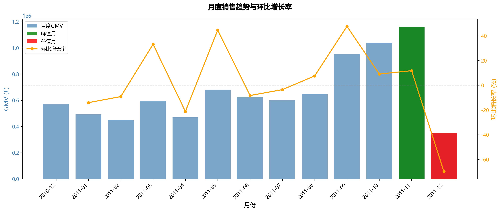
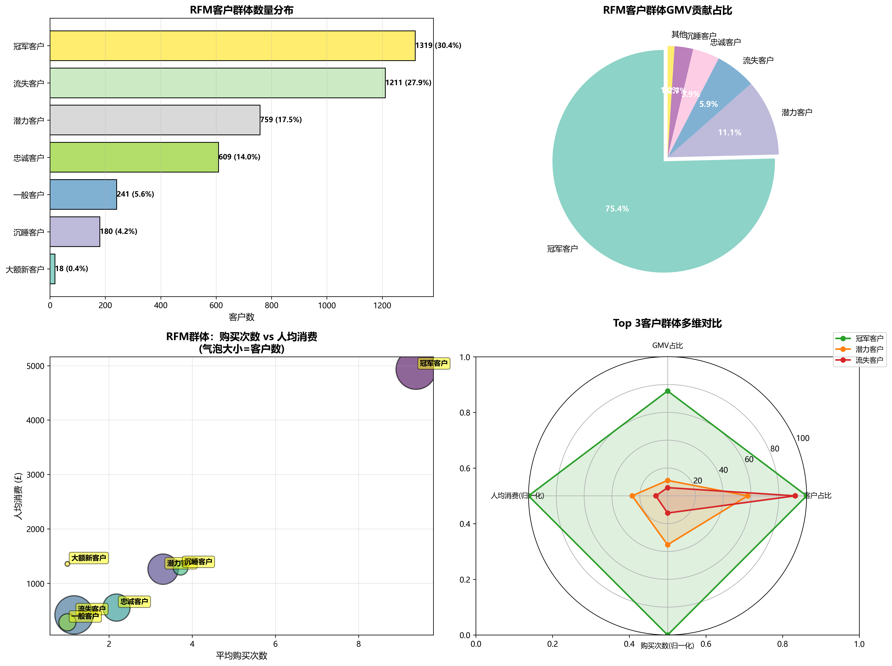
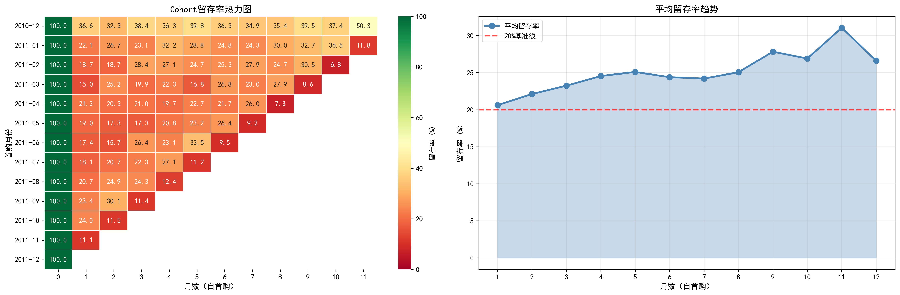
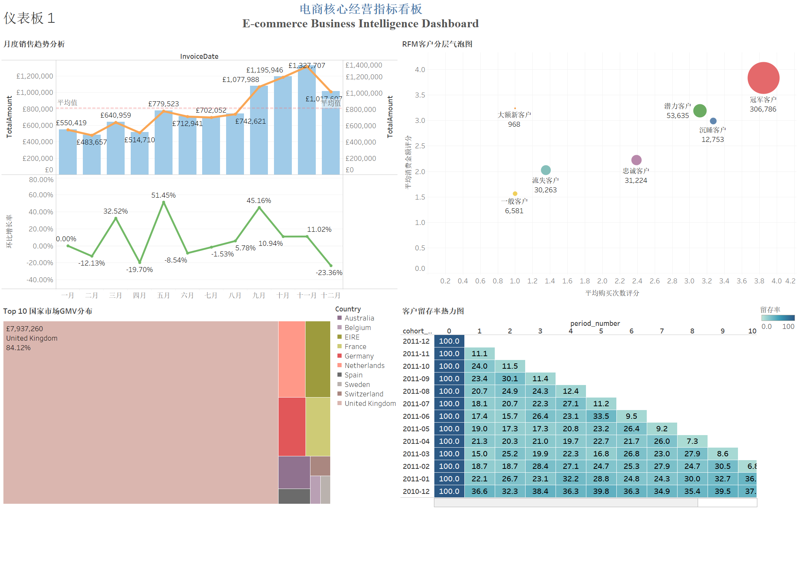

# 📊 E-commerce Analysis Project

基于2010-2011年英国电商交易数据的深度业务分析项目

## 🎯 项目概览

本项目通过**10个核心指标**深度剖析电商业务的销售增长、客户价值与运营效率，提供**数据驱动的战略建议**。

### 核心发现

- 📈 **销售增长**：月度GMV波动剧烈（-69.9%至+47.6%），存在明显季节性
- 🌍 **市场结构**：UK市场占81.42%，海外高价值市场（EIRE人均消费£88,515）待挖掘
- 👥 **客户价值**：Top 10%客户贡献60.2% GMV，复购客户贡献93.8%收入
- 🔁 **留存瓶颈**：首月留存率仅20.6%，30天是关键转化窗口

------

## 📂 项目结构

```bash
E-commerce-Analysis/
├── README.md                               # 项目介绍
├── E-commerce Analysis Report.md           # 完整分析报告（Markdown版）
├── E-commerce Analysis Report.pdf          # 完整分析报告（PDF版）
├── notebooks/
│   └── E-commerce_Analysis.ipynb           # 完整数据分析代码（清洗+10个指标+可视化）
├── results/
│   ├── 1_monthly_sales.csv                 # 月度销售数据
│   ├── ......
│   ├── 5_customer_spending.csv             # 客户消费数据
│   ├── 8_rfm_analysis.csv                  # RFM客户分层
│   ├── 10_customer_ltv.csv                 # 客户生命周期价值
│   └── viz_*.png                           # 所有可视化图表（10+张）
├── data/
│   └── data.csv                            # 原始数据集
│   └── ecommerce.db                        # 生成的数据库
└── requirements.txt                        # Python依赖包清单
```

## 🚀 快速开始

### 📍 第一步：克隆项目到本地

```bash
# 1. 打开命令行工具
# Windows: 按 Win+R，输入 cmd 或 powershell
# Mac: 打开 Terminal
# Linux: 打开终端

# 2. 切换到你想要存放项目的位置（根据你的需要修改路径）
# 例如：将项目放在 D 盘根目录
cd D:\

# 或者：将项目放在用户文档文件夹
cd C:\Users\你的用户名\Documents

# Mac/Linux 示例：
cd ~/Documents

# 3. 克隆项目
git clone https://github.com/wanter0407/E-commerce-Analysis.git

# 4. 进入项目根目录（重要！）
cd E-commerce-Analysis

# 5. 验证当前位置（可选，确认你在正确的目录）
# Windows:
cd
# Mac/Linux:
pwd
```

**✅ 确认你的命令行显示**：

```bash
# 应该类似这样（根据你实际存放的位置）
D:\E-commerce-Analysis
# 或
C:\Users\张三\Documents\E-commerce-Analysis
```

------

### 📦 第二步：安装依赖

```bash
# 确保仍在项目根目录（E-commerce-Analysis）
# 直接安装依赖包
pip install -r requirements.txt
```

**预期输出**：

```bash
Successfully installed pandas-2.2.2 numpy-1.26.4 matplotlib-3.9.2 ...
```

------

### 🚀 第三步：运行分析

#### **启动 Jupyter Notebook**

```bash
# 1. 确认仍在项目根目录（E-commerce-Analysis）
# Windows:
cd
# Mac/Linux:
pwd

# 应该显示类似：D:\E-commerce-Analysis

# 2. 直接启动 Jupyter
jupyter notebook

# 系统会自动打开浏览器，显示项目文件夹
# 在浏览器中点击 notebooks/ 文件夹，然后打开 E-commerce_Analysis.ipynb
```

------

#### **在 Jupyter 界面中运行分析**

**在 Jupyter 界面中**：

1. **打开 notebook**：点击 `E-commerce_Analysis.ipynb`
2. **运行分析**（三种方式）：
   - **方式A**：点击顶部菜单 `Cell` → `Run All`（一次运行所有单元格）
   - **方式B**：逐个单元格执行，按 `Shift + Enter`
   - **方式C**：点击工具栏的 `▶️ Run` 按钮

------

### ✨ 特别说明

- ✅ **代码使用智能路径检测**：无论从哪个目录启动 Jupyter，代码都会自动识别项目根目录
- ✅ **跨平台兼容**：在 Windows/Mac/Linux 上均可直接运行
- ✅ **零配置启动**：克隆项目后直接运行，无需修改任何代码

------

### 📊 代码运行流程

1. **自动路径检测** - 智能识别项目结构，自动设置数据和输出路径
2. **数据清洗与数据库创建** - 生成 `data/ecommerce.db`
3. **销售增长与结构分析**（指标1-4）- 生成可视化图表至 `results/`
4. **客户价值深度分析**（指标5-10）- 生成分析结果CSV至 `results/`

**自动生成的文件位置**：

```bash
E-commerce-Analysis/
├── data/
│   └── ecommerce.db                    ← 自动生成的数据库
└── results/
    ├── viz_*.png                       ← 自动生成的可视化图表（10+张）
    └── *.csv                           ← 自动生成的分析结果文件
```

## 📊 核心分析指标

### 销售增长与结构（4个指标）

1. **月度销售趋势** - 识别季节性规律与异常波动
2. **商品结构分析** - 验证帕累托法则，优化SKU组合
3. **国家市场表现** - 识别高价值市场与增长机会
4. **时间维度分析** - 优化运营时间与资源配置

### 客户价值深度（6个指标）

1. **客户消费分布** - 识别高/中/低价值客户群体
2. **复购率分析** - 评估客户粘性与复购价值
3. **购买间隔分析** - 定位流失预警关键节点
4. **RFM客户分层** - 精细化运营策略制定
5. **留存率分析** - Cohort分析识别流失瓶颈
6. **客户LTV量化** - 客户生命周期价值估算

------

## 📈 可视化示例

### 月度销售趋势



### RFM客户分层



### 留存率分析



------

## 📊 BI可视化看板

基于Tableau构建的**交互式电商经营指标看板**，支持多维度数据钻取与实时决策分析。

### 看板架构

**Dashboard总览**：



#### 四大核心模块

1. **销售趋势分析**
   - 月度GMV变化与环比增长率
   - 识别季节性规律与异常波动
   
2. **市场分布分析**
   - Top 10国家市场GMV排行
   - 地理维度销售结构可视化

3. **客户价值分层**
   - RFM模型客户分群矩阵
   - 气泡图展示7类客户群体特征

4. **留存率热力图**
   - Cohort分析追踪用户生命周期
   - 识别首月留存瓶颈（20.6%）

### 技术实现

- **数据源架构**：SQLite主库 + 4张CSV维度表混合连接
- **数据模型**：星型模型设计（事实表 + 国家/商品/客户/指标维度表）
- **可视化工具**：Tableau 2019.4
- **交互功能**：
  - 跨数据源关联查询
  - 多图表联动筛选
  - 下钻分析与动态计算字段

### 核心洞察

通过BI看板识别的关键业务问题：

| 维度         | 发现                                | 建议行动                       |
| ------------ | ----------------------------------- | ------------------------------ |
| **销售异常** | 2011年12月GMV环比暴跌69.9%          | 调查12月运营策略变更原因       |
| **市场机会** | EIRE市场人均消费£88,515（UK的49倍） | 加大爱尔兰市场营销投入         |
| **留存瓶颈** | 首月留存率仅20.6%，流失80%新客      | 优化新客首单体验与30天触达策略 |
| **客户集中** | Top 10%客户贡献60.2% GMV            | 建立高价值客户VIP体系          |

- 应用场景

  - ✅ **运营日报**：监控GMV、订单量、客单价等核心指标
  - ✅ **客户分群运营**：基于RFM模型制定差异化营销策略
  - ✅ **市场拓展决策**：识别高潜力海外市场
  - ✅ **留存优化**：追踪Cohort留存率变化，优化用户生命周期管理

  ------

  ## 🛠️ 技术栈

  - **数据处理**：Python 3.11, Pandas, NumPy
  - **数据存储**：SQLite
  - **数据分析**：SQL（窗口函数、CTE）
  - **数据可视化**：Matplotlib, Seaborn
  - **BI工具**：Tableau 2019.4 
  - **开发环境**：Jupyter Notebook

------

## 📄 完整报告

详细分析报告请查看：

- **Markdown版本**：[E-commerce Analysis Report.md](./E-commerce Analysis Report.md)
- **PDF版本**：[E-commerce Analysis Report.pdf](./E-commerce Analysis Report.pdf)

------

## 👤 作者

**Wanting Zhao**
 📧 Email: [wantingz185@gmail.com](mailto:wantingz185@gmail.com)
 🔗 GitHub: [@wanter0407](https://github.com/wanter0407)

------

## 📜 许可证

本项目采用 MIT License - 详见 [LICENSE](LICENSE) 文件

------

## 🙏 致谢

- 数据来源：[UCI Machine Learning Repository - Online Retail Dataset](https://archive.ics.uci.edu/ml/datasets/online+retail)
- 分析框架参考：RFM模型、Cohort分析

------

**如果觉得这个项目对你有帮助，请给个⭐Star支持一下！**